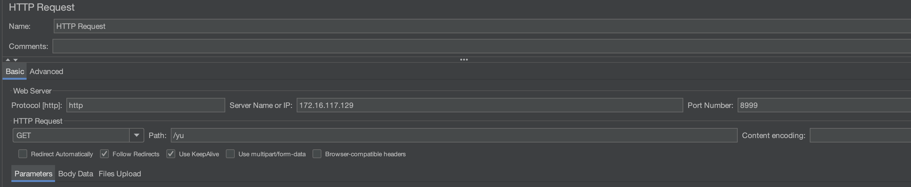
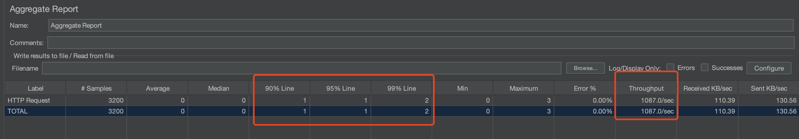
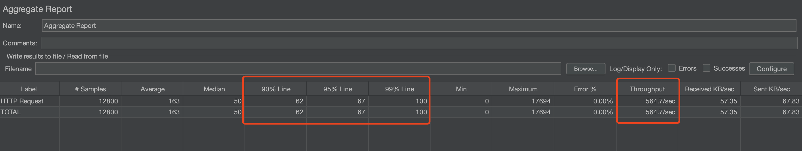
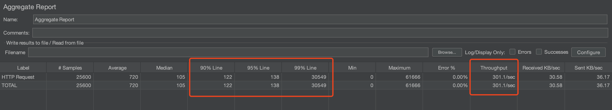

# 协程式异步网络框架
## BENCHMARK

### case1
参数设置
服务端worker线程数 100
Jmeter线程数设置 32
Jmeter线程启动时间 3
Jmeter每个线程循环次数 100
请求设置

实验指标
指标：尾部延迟、平均吞吐量

### case2
参数设置
服务端worker线程数 100
Jmeter线程数设置 128
Jmeter线程启动时间 12
Jmeter每个线程循环次数 100
请求设置

实验指标
指标：尾部延迟、平均吞吐量

### case3
参数设置
服务端worker线程数 100
Jmeter线程数设置 256
Jmeter线程启动时间 25
Jmeter每个线程循环次数 100
请求设置

实验指标
指标：尾部延迟、平均吞吐量

## USAGE
软件环境: cmake3.22.1 gcc11.4.0 Ubuntu22.04.5LTS
使用前需安装外部库yaml-cpp、boost
1. 安装yaml-cpp
```shell
git clone https://github.com/jbeder/yaml-cpp.git
mkdir build
cd build
cmake [-G generator] [-DYAML_BUILD_SHARED_LIBS=on|OFF] ..
sudo make install
```
2. 安装boost
```shell
sudo apt update
sudo apt install libboost-all-dev
```

---
参考博客: [从零开始重写sylar C++高性能分布式服务器框架](https://www.midlane.top/wiki/pages/viewpage.action?pageId=10060952)<br>
参考项目: [C++高性能分布式服务器框架](https://github.com/zhongluqiang/sylar-from-scratch)
