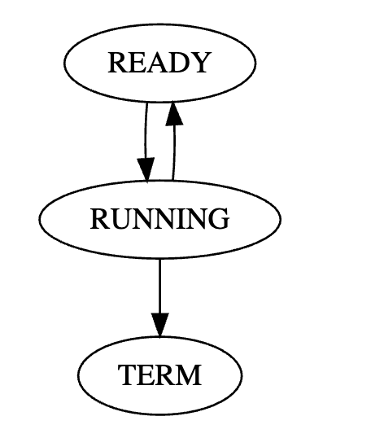
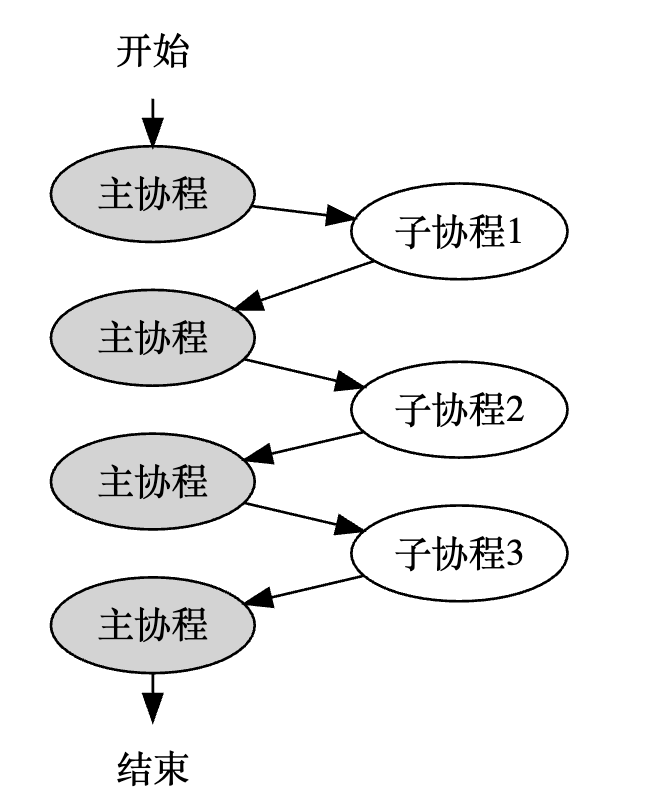
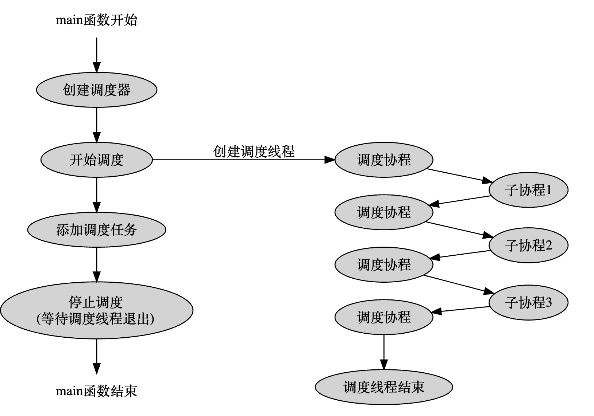
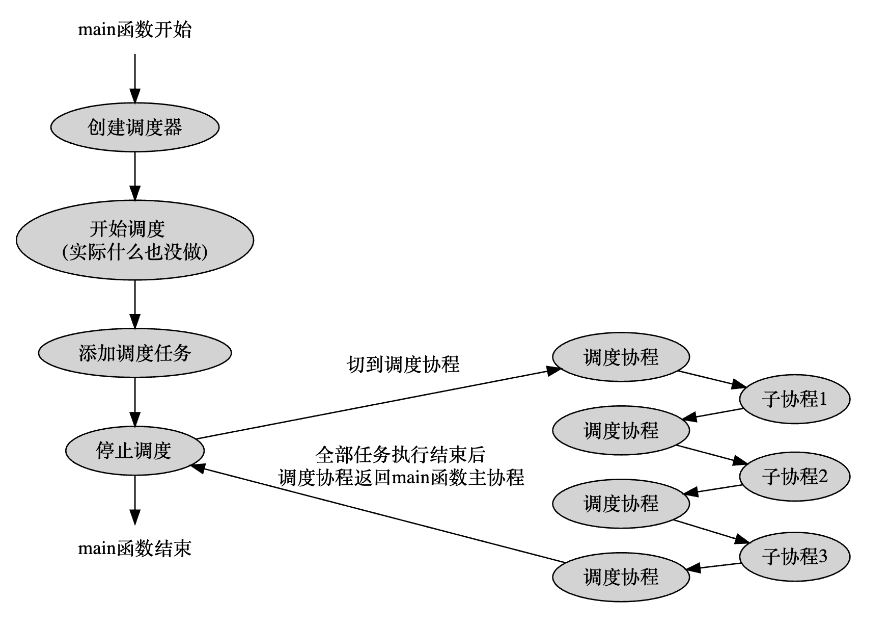

# Coroutine-based Asynchronous Network Framework
- 通过 hook 包装系统调用（如 IO、sleep），使同步代码风格即可实现异步效果，避免 Boost.Asio、libevent 等框架的 “回调地狱” 问题；
- 基于协程的轻量级上下文切换，相比线程调度减少开销，在高并发场景下性能更优，同时比 Seastar 等强依赖硬件的框架更易部署在普通服务器环境。
## INTRODUCTION
### 日志模块
- 日志级别从小到大分为 DEBUG、INFO、WARN、ERROR、FATAL（日志级别不小于日志器级别才可以输出）
- 包含Logger（日志器）、LoggerFormatter（日志格式器）、LoggerAppender（日志输出器）、LoggerEvent（日志事件），Logger需指定一个LoggerFormatter（一个LoggerFormatter包含多个FormatItem）用于定制化输出格式，可以装配一个或多个LoggerAppender（例如表示输入到文件或终端），每条日志信息由一个LogerEvent表示。还增添了LoggerManager（日志器管理类、工厂模式）
- 通过宏定义支持流式和格式化日志
- 待改进点：在高并发场景下采用异步批量写入日志，由主线程将LoggerEvent放入消费队列，由后台线程消费并写入LoggerAppender，避免主线程业务阻塞

### 协程
1. 协程是什么？
> 可以把它理解为一种高级的函数，与普通函数不同，它可以在执行到一半yield保存上下文并退出，之后再resume回复到断点为止继续执行，被称为一种轻量级/用户态协程。一个线程上可以跑多个协程（并发执行，不可并行），此时该线程为抽象为一个主协程
2. 进程、线程、协程上下文切换开销的大小是怎么排序
> - 进程>线程>协程
> - 进程：由内核调度，切换时需要保存CPU寄存器信息、PCB块、文件描述符列表、切换页表、TLB缓存会失效
> - 线程：由内核调度，切换时需要保存CPU寄存器信息、TCB块、无需切换页表、TLB缓存不会失效
> - 协程：在用户程序调度，切换时需要保存CPU寄存器信息（仅用户态寄存器）、协程用户块
> -  协程拥有自己独立的用户态栈（由用户程序分配）

### IO协程调度模块
该模块基于ucontext库实现，其核心API如下
```cpp
// 上下文结构体定义
// 这个结构体是平台相关的，因为不同平台的寄存器不一样
// 下面列出的是所有平台都至少会包含的4个成员
typedef struct ucontext_t {
    // 当前上下文结束后，下一个激活的上下文对象的指针，只在当前上下文是由makecontext创建时有效
    struct ucontext_t *uc_link;
    // 当前上下文的信号屏蔽掩码
    sigset_t          uc_sigmask;
    // 当前上下文使用的栈内存空间，只在当前上下文是由makecontext创建时有效
    stack_t           uc_stack;
    // 平台相关的上下文具体内容，包含寄存器的值
    mcontext_t        uc_mcontext;
    ...
} ucontext_t;
 
// 获取当前的上下文
int getcontext(ucontext_t *ucp);
 
// 恢复ucp指向的上下文，这个函数不会返回，而是会跳转到ucp上下文对应的函数中执行，相当于变相调用了函数
int setcontext(const ucontext_t *ucp);
 
// 修改由getcontext获取到的上下文指针ucp，将其与一个函数func进行绑定，支持指定func运行时的参数，
// 在调用makecontext之前，必须手动给ucp分配一段内存空间，存储在ucp->uc_stack中，这段内存空间将作为func函数运行时的栈空间，
// 同时也可以指定ucp->uc_link，表示函数运行结束后恢复uc_link指向的上下文，
// 如果不赋值uc_link，那func函数结束时必须调用setcontext或swapcontext以重新指定一个有效的上下文，否则程序就跑飞了
// makecontext执行完后，ucp就与函数func绑定了，调用setcontext或swapcontext激活ucp时，func就会被运行
void makecontext(ucontext_t *ucp, void (*func)(), int argc, ...);
 
// 恢复ucp指向的上下文，同时将当前的上下文存储到oucp中，
// 和setcontext一样，swapcontext也不会返回，而是会跳转到ucp上下文对应的函数中执行，相当于调用了函数
// swapcontext是sylar非对称协程实现的关键，线程主协程和子协程用这个接口进行上下文切换
int swapcontext(ucontext_t *oucp, const ucontext_t *ucp);
```
- 协程状态(INIT、EXEC、HOLD、TERM）
- 实现非对称协程：相比于对称协程（子协程可以和子协程切换），代码实现简单。
- 设计了两个线程局部变量（t_fiber和t_thread_fiber），其中t_thread_fiber存储线程主协程上下文，t_fiber存储当前线程正在执行的协程上下文
- 协程调度器在初始化时支持传入线程数、use_caller（是否使用 主线程/caller线程）。线程池中的每个调度线程（非caller线程）就是调度协程；当caller线程加入调度时，会创建一个子协程（为caller线程的调度协程）并切换。这种情况下需要进行如下修改
    1. 引入额外的一个线程局部变量（t_scheduler_fiber）用于存储调度协程上下文
    2. 给Fiber类添加一个bool字段runInScheduler（表示该协程是否通过调度器执行，线程主协程和调度协程都应该为false）
    3. 如果Fiber的runInScheduler为true，resume时和t_scheduler_fiber切换，yield时也应该恢复t_scheduler_fiber
    4. 如果Fiber的runInScheduler为false，resume时和t_thread_fiber切换，yield时也应该恢复t_thread_fiber
       假设线程数为1，且use_caller=true，那么该协程调度器只使用 主线程/caller线程 进行调度，如图4所示
- 每个调度协程负责从调度任务队列中取子协程执行，此时调度协程和子协程的切换模型如图2所示，如果任务队列空了，调度协程会切换到一个idle协程（直到有新任务才会被tickle唤醒切换回调度协程）
- idle协程引入了IO多路复用机制（基于epoll），会使用epoll_wait监听读写事件的fd三元组（描述符-事件类型-回调函数）和pipe fd（tickle时会触发读事件），若有事件触发idle会在处理事件后切换为调度协程

| 协程状态切换（图1)                    | 非对称调度（图2）                        | 协程调度器（use_caller=false)（图3）                          | 协程调度器（use_caller=true）（图4）                          |
|-------------------------------|-----------------------------|-------------------------------|-------------------------------|
|  |  |  |  |

### 定时器模块
- 实时事件依赖Linux提供的定时机制
    1. alarm()或setitimer()设置一个超时时间（毫秒级），然后等待SIGALARM信号触发，通过捕获信号来判断超时
    2. select/poll/epoll设置超时参数（毫秒级），通过返回值为0来判断超时，减少了插入开销 (采用)
- 三种定时器实现
    - 升序链表：添加定时器时间复杂度为O(n)、删除为O(1)，当定时器数量较多时，链表插入开销大 
    - 时间轮：通过哈希表的思想，将定时器散列到不同的链表上时间轮 （实现）
    - 最小堆 （实现）
- 三种定时器应用场景
    - 若定时器数量少、变动少：选升序链表（简单优先）。
    - 若定时器数量极多、精度要求不高（如服务器连接管理）：选时间轮（性能优先）。
    - 若定时器数量中等、需高频触发超时、精度要求高：选最小堆（平衡优先）

### Hook模块
当协程在调用原socket API如sleep、read、write时，会发生阻塞，此时这个调度线程就被阻塞了，其它协程无法在这个线程上执行，需要采取措施解决这个问题——引入Hook模块
Hook模块的核心思想类似于装饰器，将socket IO相关API进行一层包装（wrapper）
- sleep：添加一个定时器任务（回调函数是在调度器上继续调度本协程），然后yield，等待定时器超时
- read/write：往epoll注册读写IO事件（回调函数为执行实际的读写操作），然后yield，等待读写事件触发
在这种情况下，调度线程并不会发生阻塞，调用方也很方便，只需要以同步的方式编写代码，实现效果却是异步的
基于动态链接的hook有两种方式
1. 非侵入式：不需要重新编译代码，通过设置 LD_PRELOAD环境变量为自定义加载动态库替换掉原来的库
2. 侵入式：重新编译代码并指定加载的动态库；或者改造代码使得符号表中先出现自定义函数符号 (采用该方式)
> 在实现hook模块使用dlsym函数找回原API

## TCPServer模块和HttpServer模块
- TCPServer采用了模版方法模式实现，网路模型为主从Reactor
- HttpServer在TCPServer的基础上实现，引入了nodejs/http-parser外部库，在接收数据的过程中，边接收数据，边解析（内部采用了状态机）

## BENCHMARK
### case1
参数设置
服务端worker线程数 100
Jmeter线程数设置 32
Jmeter线程启动时间 3
Jmeter每个线程循环次数 100
请求设置

实验指标
指标：尾部延迟、平均吞吐量

### case2
参数设置
服务端worker线程数 100
Jmeter线程数设置 128
Jmeter线程启动时间 12
Jmeter每个线程循环次数 100
请求设置

实验指标
指标：尾部延迟、平均吞吐量

### case3
参数设置
服务端worker线程数 100
Jmeter线程数设置 256
Jmeter线程启动时间 25
Jmeter每个线程循环次数 100
请求设置

实验指标
指标：尾部延迟、平均吞吐量

## USAGE
软件环境: cmake3.22.1 gcc11.4.0 Ubuntu22.04.5LTS
使用前需安装外部库yaml-cpp、boost
1. 安装yaml-cpp
```shell
git clone https://github.com/jbeder/yaml-cpp.git
mkdir build
cd build
cmake [-G generator] [-DYAML_BUILD_SHARED_LIBS=on|OFF] ..
sudo make install
```
2. 安装boost
```shell
sudo apt update
sudo apt install libboost-all-dev
```

3. httpserver例子
```cpp
#include "../yxtwebcpp/yxtwebcpp.hpp"

static std::shared_ptr<YXTWebCpp::Logger> g_logger = YXTWebCpp_LOG_ROOT();


class MyServlet : public YXTWebCpp::http::Servlet {
public:
    uint64_t handle(std::shared_ptr<YXTWebCpp::http::HttpRequest> req, std::shared_ptr<YXTWebCpp::http::HttpResponse> res, std::shared_ptr<YXTWebCpp::http::HttpStream> stream) {
        res->setBody("I don't know");
        return 0;
    }
};

void testhttpserver() {
    std::shared_ptr<YXTWebCpp::http::HttpServer> server(new YXTWebCpp::http::HttpServer(true));
    auto addr = YXTWebCpp::IPAddress::Create("192.168.159.130", 8999);
    std::vector<std::shared_ptr<YXTWebCpp::Address> > addrs, fail;
    addrs.push_back(addr);
    server->getServletDispatch()->addServlet("/yu", [](std::shared_ptr<YXTWebCpp::http::HttpRequest> req, 
                                                    std::shared_ptr<YXTWebCpp::http::HttpResponse> res, 
                                                    std::shared_ptr<YXTWebCpp::http::HttpStream> stream)->uint64_t {
        res->setBody("Hello, I am yuxintao");
        return 0;
    });
    server->getServletDispatch()->addServlet("/", std::make_shared<MyServlet>());
    while (!server->bind(addrs, fail)) {
        sleep(2);
        YXTWebCpp_LOG_DEBUG(g_logger) << "bind again";
    }
    server->start();
}

int main() {
    YXTWebCpp::IOManager iom;
    iom.schedule(testhttpserver);
    return 0;
}
```
---
参考博客: [从零开始重写sylar C++高性能分布式服务器框架](https://www.midlane.top/wiki/pages/viewpage.action?pageId=10060952)<br>
参考项目: [C++高性能分布式服务器框架](https://github.com/zhongluqiang/sylar-from-scratch)